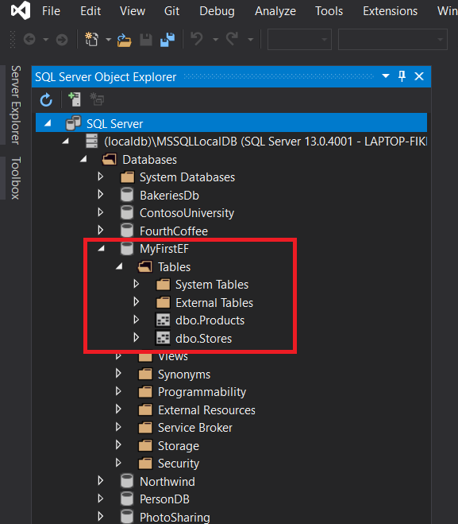

# Creating-an-Entity-Type-DbContext-and-DbInitializer

1. **Nombres y apellidos:** Carola Casais Recondo
2. **Fecha:** Miércoles 16 de noviembre de 2020
3. **Resumen del Ejercicio:** El objetiivo es crear un EF.
4. **Dificultad o problemas presentados y como se resolvieron:** No hubo dificultades en este ejercicio.
